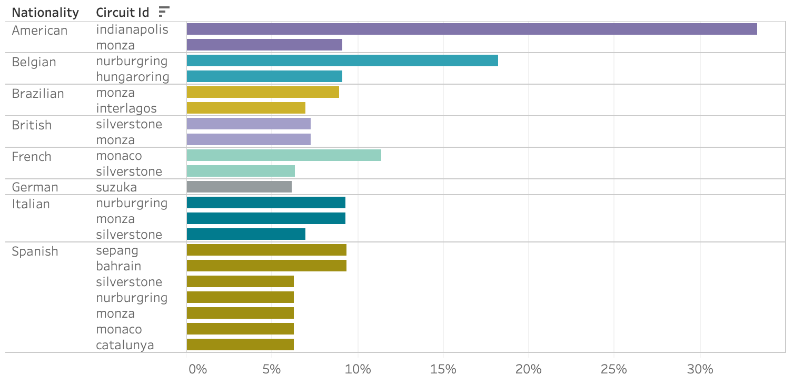
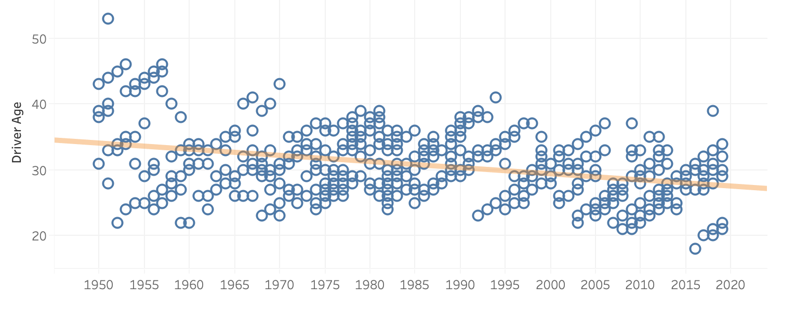
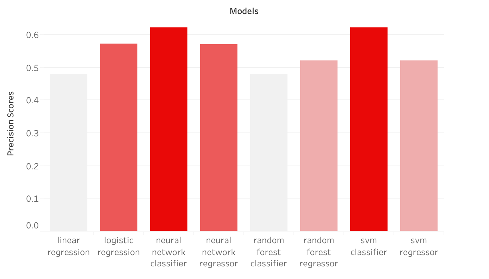
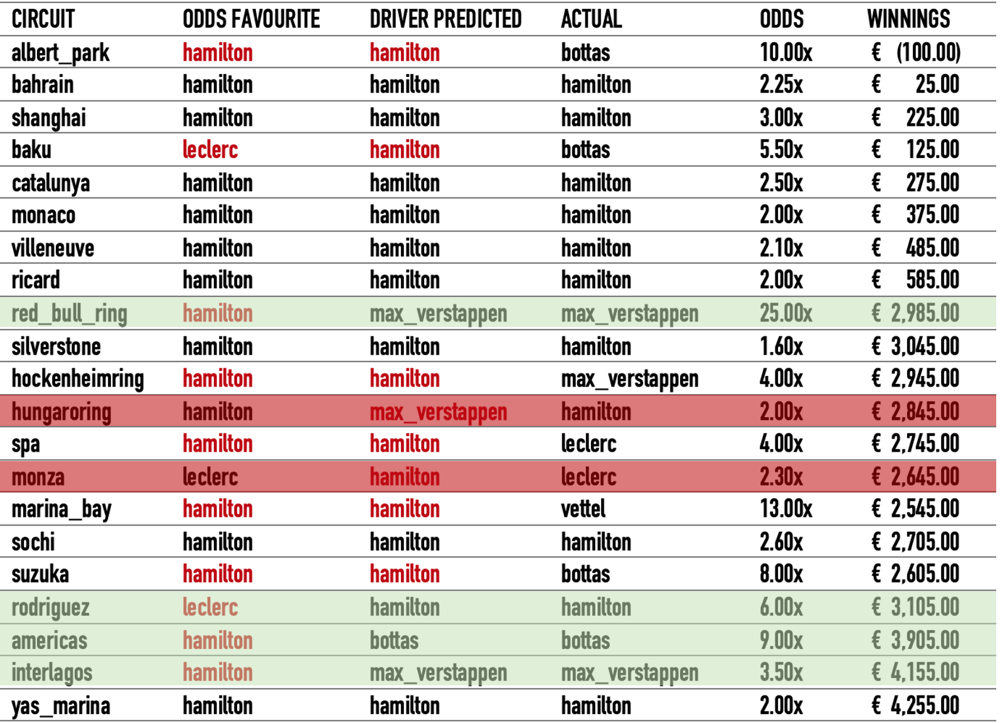

# Formula 1 Race Predictor

The purpose of this project is to build an algorithm to predict the winner in all 21 races of Formula 1 in season 2019.

## Data Collection

Files : `API_races`, `qualifying`, `weather`

For my data mining I used two sources: the [Ergast F1](https://ergast.com/mrd/) data repository and the official 
[Formula 1 website](https://www.formula1.com/), which contain information about all the championships and races from 
1950 to 2019.
Eventually I combined all the data about races, results, drivers and constructors standing positions, 
qualifications and weather into a single dataframe.

## EDA

### How important is the pole position?

During qualification sessions the drivers try to set their fastest time around the track and the grid position
is determined by the drivers' best single lap, with the fastest on pole position. Starting on pole position is crucial
in those circuits where overtaking is more difficult, in addition to having the advantage of staring a few meters ahead
and on the normal racing line, which is usually cleaner and has more grip. The following graph shows the correlation between
staring in pole position and winning the race in some of the most popular circuits.

### What's the impact of racing in your home country?

The advantage of racing in your home country could be attributed to the psychological impact that supporting fans have
on the the drivers, as well as driving near home in familiar situation. The bar chart shows some of the nationalities of
the drivers that ended up first on the podium during the years and their respective percentage count of wins over all 
circuits races. Despite not showing a sharp difference, we can notice that even psychological factors play a role in the
likelihood of winning a race.

### Most dangerous circuits

Some of the circuit layouts have been redesigned over the years to meet stricter safety requirements. Currently, 
most of the circuits are specifically constructed for competitions, in order to avoid long and fast straights or dangerous
turns. However, some races are still held at street circuits, such as the Monaco Grand Prix, which is still in use mainly
for its fame and history, despite not conforming with the latest strict measures. The following tree-map shows some of the 
most popular tracks by number of incidents or collisions.

### Which teams had more car failures?

The bar chart shows which teams that raced in the last few seasons experienced the highest number of car problems over 
the years, including engine failures, brakes, suspension or transmission problems.

### Who's more prone to crash?

Cars in Formula 1 can reach top speeds of 375 km/h (233 mph) so crashes can ultimately terminate the race for the drivers. 
The chart below shows the ratio of crashes of some of the drivers that raced in the last two seasons.

### From fast 40-year-olds to teenage stars

In the early years of the world championship, the majority of leading drivers were in their forties.
However it was only a matter of time before they got replaced by the new generation. From the 1960s to 1993 the average age
was around 32 years old and in the latest seasons there are only a few drivers aged over 30. 
The following scatterplot shows the age of the winning drivers from the first inaugural season, 
showing a downward sloping trend line.

## Machine Learning Modelling

### Success metrics

- **Precision score:**  percentage of correctly predicted winners in 2019 season
- **Odds comparison:**  can my model beat the odds?

### Data Preparation

After collecting all the data, I end up with six different dataframe which I have to merge together using common keys. 
My final dataframe includes information of races, results, weather, driver and team standings and qualifying times from 1983
to 2019.
I also calculated the age of drivers and the cumulative difference in qualifying times so that I would have an indicator
of how much faster is the first car on the grid compared to the other ones for each race. Eventually I dummify the circuit,
nationality and team variables, dropping those that are not significantly present.

### Regression or classification problem?

Since I want to predict the first place on the podium for each race in 2019, I can treat the target variable as either a
regression or a classification. 

When evaluating the precision score of a **regression**, I sort my predicted results in an ascending order and map the
lowest value as the winner of the race. Eventually, I calculate the precision score between the actual values and predicted
(mapped 1 and 0) and repeat for each race in 2019, until I get the percentage of correctly predicted races in that season.

In a **classification** problem the target is mapped 0 and 1 (winner) prior to modelling so, when I look at the predicted values,
I might have more than one winner or no winner at all depending on the predicted probabilities. Because my algorithm is not 
smart enough to understand that I only need one winner for each race, I created a different scoring function for 
classification that ranks the probabilities of being the winner of the race for each driver. I sort the probabilities 
from highest to lowest and map the driver with the highest probability as the winner of the race.

### Modelling

Since my custom scoring function requires the model to be fitted prior to the evaluation, I have to do a manual grid search
of the different models, eventually appending the scores and parameters used to a dictionary.

I tried using logistic and linear regressions, random forests, support vector machines and neural networks for both regression
and classification problems.

TRAIN - TEST SPLIT: the train set contains all races from 1983 to 2018 inclusive. 
The test set consists of all 21 races in the season of 2019.

### Findings

After taking a few days to run all the grid searches, classification with neural networks and SVM seem to return the highest
scores, correctly predicting the winner for 62% of the races in 2019, which corresponds to 13/21 races.

I also used season 2018 and 2017 as test sets to check whether the models would still perform well.  
Neural Networks returned a score higher than SVM classifier in both years so I decided that NN classifier 
with the following parameters would be my pick.
- hidden_layer_sizes = (75, 25, 50, 10)
- activation = identity
- solver = lbfgs
- alpha = 0.01623776739188721

Considering **feature importance** according to linear regression, the grid position seem to play the most 
important role in predicting the winner, along with other features such as teams or points prior to the race.

Looking at the results from the past years, I noticed that the algorithm consistently mistakenly predicts the 
winner for some circuits, probably because more accidents or overtakings take place. The hardest circuits to predict 
turned out to be Albert Park, Baku, Spa, Monza and Hockenheim Ring.

### Can the algorithm beat the odds?

After getting all my predicted winners together, I decided to look at the odds published by SkySport for the races in
season 2019 and found the reward that I would have won, had i bet on those races. 

The table below shows under "Odds favourite" the driver with the highest chances of winning the race according
to SkySport, whereas "Driver predicted" is the winner predicted by the neural network. The drivers' names in red 
indicate a wrong prediction, thus different form the "Actual" driver column. The rows highlighted in green indicate 
that the algorithm's predicted driver turned out to be correct, contrary to the odds prediction; whereas, the highlights
in red show that I should have probably have bet on the odds favourite. The last two columns show the odds reward and the
profit that I would have made if I had consistently invested 100€ on each race, ending up with a profit of 4,255.00€.

